# Ruby Mailer 设计文档 {ignore}

> 学号：22373080
> 姓名：沈锎

[TOC]

## 功能介绍与展示

### 用户功能与角色

系统共有三种类型的用户：用户（**顾客**）、**商家**、**管理员**。目前顾客与商家可自由注册，管理员账户通过 `db/seeds.rb` 文件自动注入数据库（用户名：`admin`，密码：`admin`）。

### 登录与注册

用户可以登录为指定的角色，理论上支持单一用户多重角色，但目前没有接口能够增加用户的角色。用户同样可以选择注册成为顾客或者商家，但不能注册成为管理员。

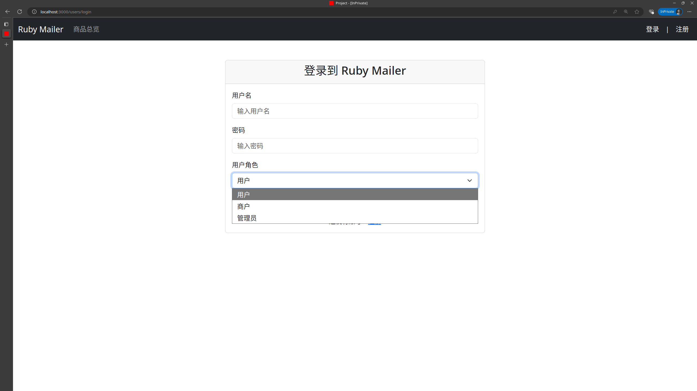

用户可以在个人中心中查看自己的信息，并修改自己的邮箱与密码（虽然目前邮箱并没有实际用处）。

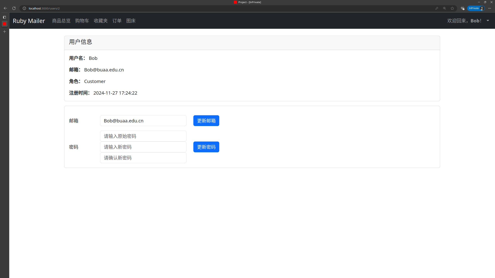

### 顾客的功能行为

顾客可以浏览商品，并查看其他用户的评论。商品总览界面如下图所示。用户可以**发表评论并进行评分**，一件商品只可评论一次，但可以随时删除或者修改。

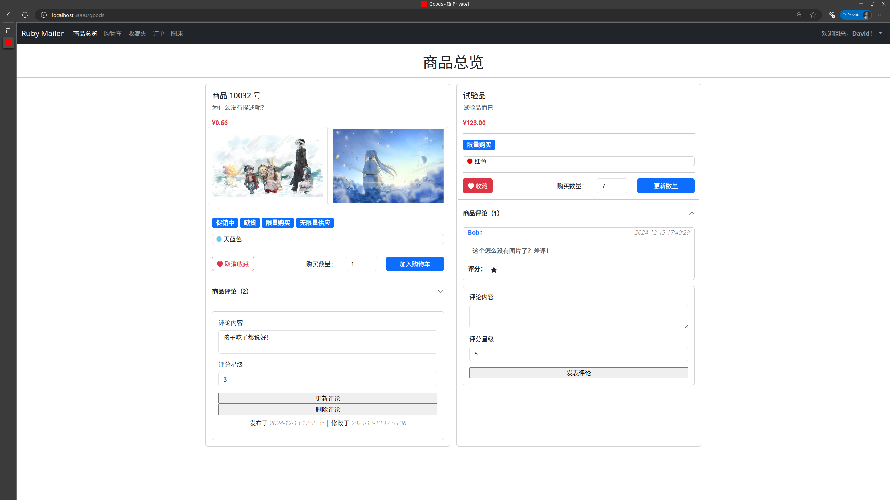

用户可以将自己喜欢的商品**添加入收藏夹**，并**添加至购物车**中。在商品总览中，用户也可以将商品移除收藏夹，或者调整购买数量。用户拥有两个专门的页面可以**查看自己的购物车与收藏夹**，并对其中的内容进行操作。

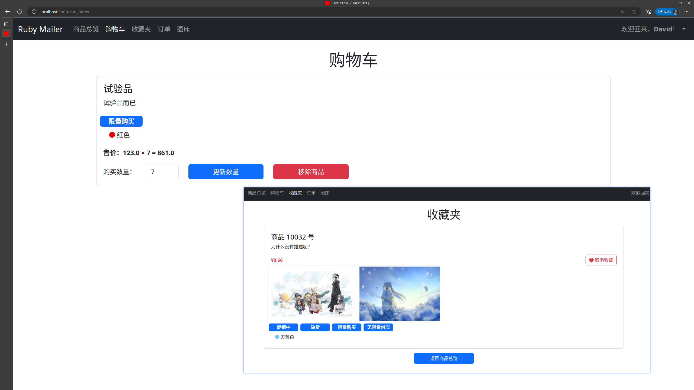

用户可以创建订单，本项目提供了一个从购物车导入商品及数量的功能，在创建订单时会**自动为用户填充**。创建订单时，用户也可以看到商品的价格，以及自己的收藏夹状态。

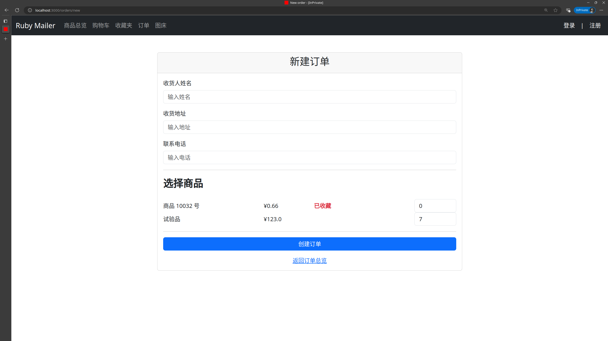

用户可以查看自己的全部订单，并进行修改或删除，本项目也会呈现给用户一些额外的信息，比如订单的**总价**等。

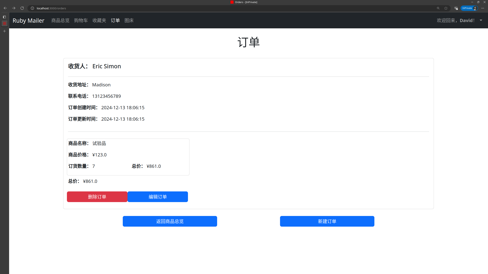

### 商家的功能行为

商家（以及管理员）可以浏览所有商品，并编辑商品的信息与属性信息，如下图展示的是对商品信息进行修改的界面，在另一个界面中，可以修改商品的属性。

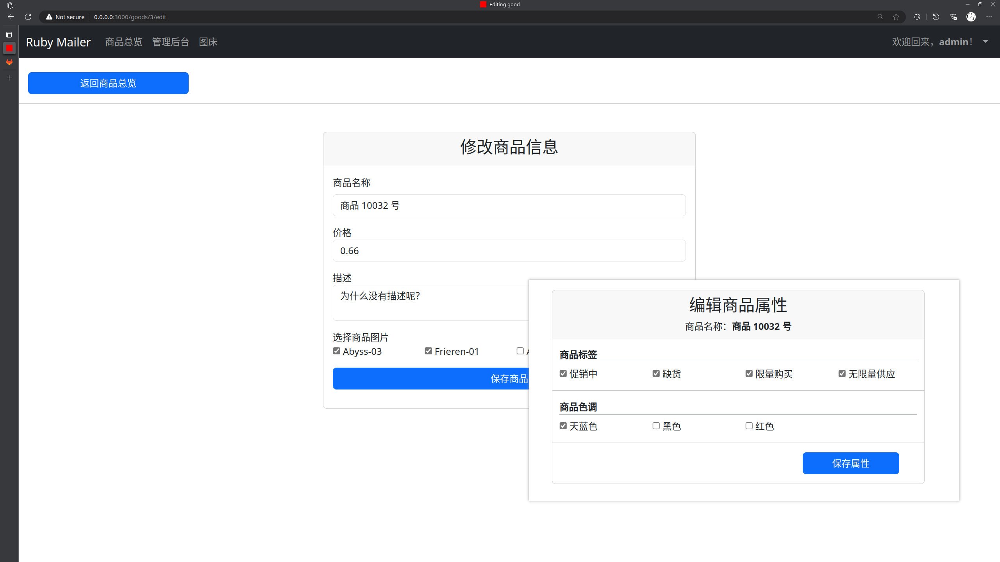

商家（仅商家）还可以查看订单信息，但不可以修改或删除。

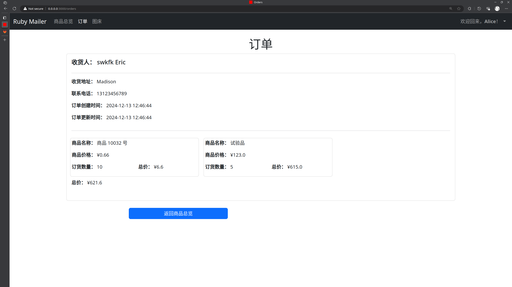

### 管理员的功能行为

管理员页面如下展示：

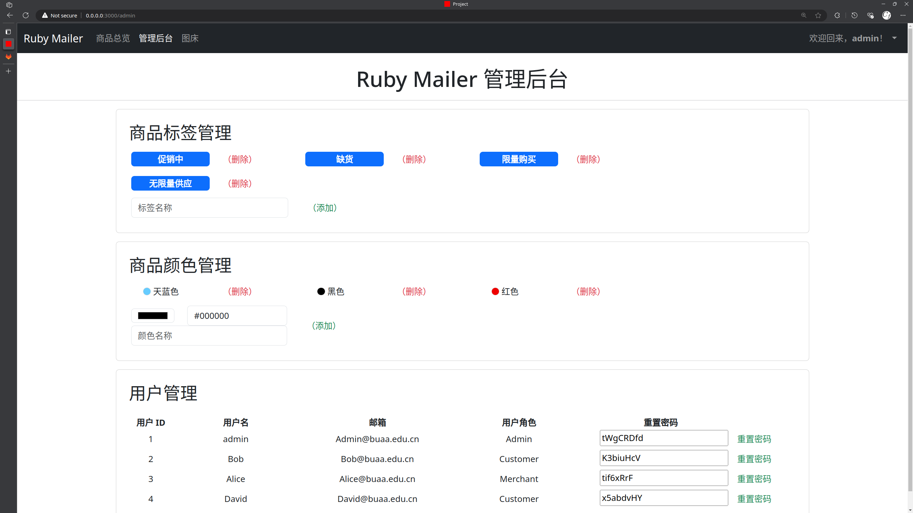

具备商品**标签管理**与**颜色管理**，可以增添或删除商品的标签与颜色。

标签与颜色可以在商品属性中进行编辑，并展示给顾客。

同时，管理员还可以**对全部用户进行管理**，但仅限于重置密码。每次进入页面，都会随机生成一个 8 位的推荐密码，当然也可以自行设置。

管理员也可以查看并修改**商品信息与属性信息**。

### 图床功能介绍

登录用户可以将图片上传到图床，并设置相应的标题。图床内容列表**仅自己可见**。在用户（商家或者管理员）创建或者修改商品时，可以指定**商品选用的图片**。顾客也可以有自己的图床，但目前没有实际用处。计划在评论中引入图片，并且实现起来没有难度，但受限于开发时间，实际并未实现。

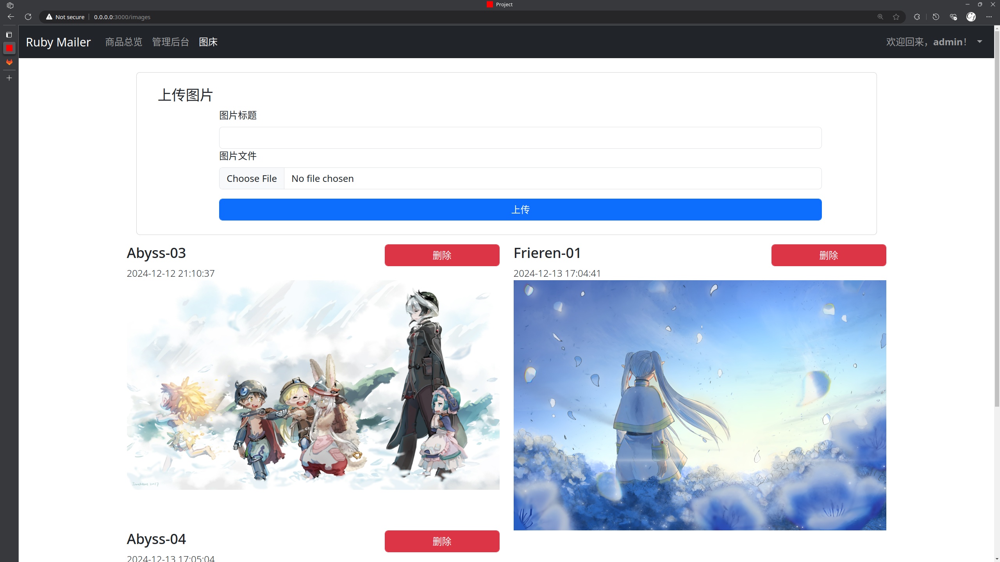

此外，用户可以**删除**图床中的图片，也可以通过保存图片的方式**将图片下载**。项目中并没有提供修改图片标题的功能。

## 数据库设计

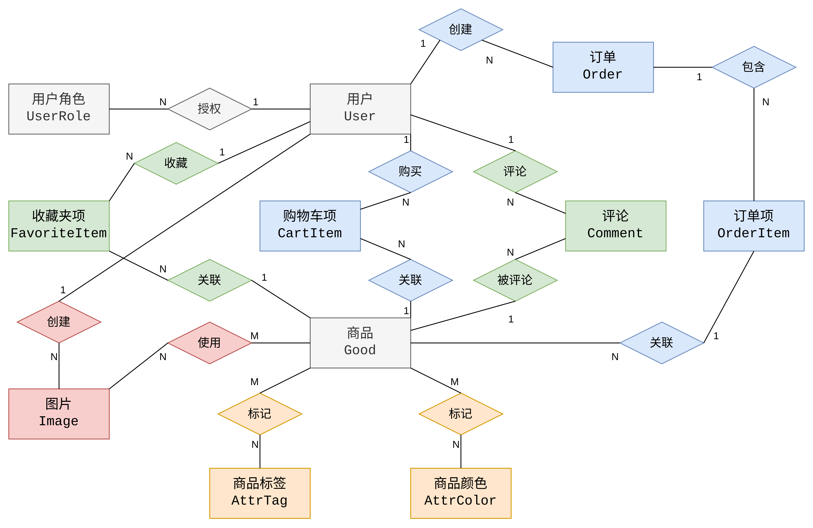

项目共涉及 **11 个实体**，并具备用户权限管理机制。

数据库设计的 **E-R 图**如上所示。其中，收藏夹项与购物车项实际上是构建了**用户与商品之间的多对多关系**。

## 实现细节

### 图床的搭建与部署

#### 密钥配置

本项目使用腾讯云 COS 作为图片存储的目的地，并实践了 `ActiveStorage` 的相关使用方式。

腾讯云的配置部分略去，总之是要拿到 `access_key_id` 与 `secret_access_key`，并将它们填入 credentials 中：

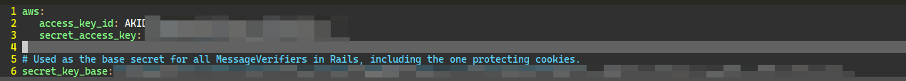

使用命令 `rails credentials:edit` 可以打开并进行编辑。注意，可能需要配置 `EDITOR` 环境变量，我的建议是设置为 `vim`，使用 VS Code 可能需要加一个 `--wait` 参数，未经检验。

此时，在 `config` 中会产生一个文件 `master.key`，这个是千万如何都不可以传到 git 中的，可以通过在 gitlab 中配置 CI/CD 变量使用。

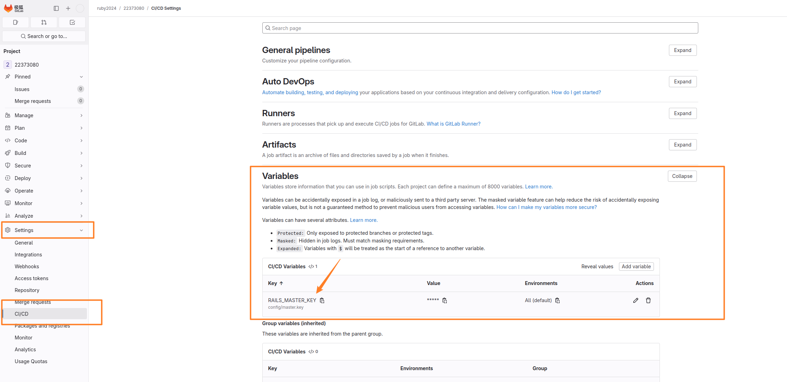

> 如果没有权限，可以找助教或者老师帮忙哦 ～

修改 `.gitlab-ci.yml`，经过实践，可行的方式是直接写入 `config/master.key`：

```diff
 deploy-project:
   stage: deploy
   script:
     - rsync -arv --delete  --exclude="*.sqlite3" ./project /
     - cd /project
     - bundle install
+    - echo "$RAILS_MASTER_KEY" > /project/config/master.key
     - rails db:migrate
     - rails db:seed
     - sv restart project
   only:
     - project
```

#### 图床的配置

需要添加 `aws-sdk-s3` gem 包以提供图床服务，并在 `project/config/storage.yml` 中添加配置项：

```yaml
amazon:
  service: s3
  access_key_id: <%= Rails.application.credentials.dig(:aws, :access_key_id) %>
  secret_access_key: <%= Rails.application.credentials.dig(:aws, :secret_access_key) %>
  region: ap-xxxxxxx
  bucket: xxxxx-1xxxxxxxxx
  endpoint: https://cos.ap-xxxxxxx.myqcloud.com
```

需要注意，要额外设置一下 `endpoint`，这在我找到的教程中没有提到！并在 `project/config/environments/` 的相关配置中设置为使用 `amazon` 配置：

```diff
-  config.active_storage.service = :local
+  config.active_storage.service = :amazon
```

随后，便可按照 `ActiveStorage` 的参考流程注册 `migration`，并使用相关数据。

### 通过 seed 注入数据

本项目通过 `db/seeds.rb` 实现了初始数据的注入，内容如下：

```ruby
%w[Admin Merchant Customer].each do |role_name|
  UserRole.find_or_create_by!(name: role_name)
end

User.find_or_create_by!(name: 'admin') do |user|
  user.name = "admin"
  user.password = "650866740170da66899f27952fb6b7420080e025"
end

if User.find_by(name: 'admin').user_roles.find_by(name: 'Admin').nil?
  User.find_by(name: 'admin').user_roles << UserRole.find_by(name: 'Admin')
end
```

分别添加了三种用户角色、注册了 admin 账号（使用非明文密码，预先计算好的），并授予其 `Admin` 角色。

### 引入 Bootstrap 作为 css 库

Bootstrap 是一个先进（至少曾经先进过）的响应式 css 库，能够帮助我们的项目更好地呈现效果。现将引入方式介绍如下：

引入两个 gem 包：

```ruby
gem 'bootstrap', '~> 5.3.0'
gem 'sassc-rails'
```

将 `project/app/assets/stylesheets/application.css` 重命名为 `project/app/assets/stylesheets/application.scss`，并写入内容：

```scss
@import "bootstrap";
```

在 `project/app/javascript/application.js` 中写入内容：

```js
import "bootstrap";
```

即可使用，网络上的教程多数并不适用。

将 `views/layouts/application.html.erb` 的 `<body>` 标签修改如下，即可看到效果：

```erb
  <body>
  <header>
    <nav class="navbar navbar-expand-md navbar-dark bg-dark mb-4">
      <div class="container-fluid">
        <a class="navbar-brand" href="#">Ruby Mailer</a>
        <div class="collapse navbar-collapse" id="navbarCollapse">
          <ul class="navbar-nav me-auto mb-2 mb-md-0">
            <li class="nav-item">
              <a class="nav-link" href="#">商品预览</a>
            </li>
            <li class="nav-item">
              <a class="nav-link" href="#">购物车</a>
            </li>
            <li class="nav-item">
              <a class="nav-link" href="#">订单</a>
            </li>
          </ul>
        </div>
      </div>
    </nav>
  </header>
  <%= yield %>
  </body>
```
